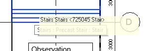

# WinTooltip

Revit .NET C# add-in implementing a custom tooltip using UIView and ray casting.

First implemented in October 2012 to demonstrate and make use of the new Revit 2013 API features including the View API and `UIView` class.

In Revit 2017, it displays Revit database element information in a very rough custom tooltip like this:

If you are really lucky, this sample and Revit itself will agree on what element you are pointing at and both will display information about the same item simultaneously:

For more information, please refer to the two introductory discussions and implementation notes:

- [UIView and Windows Device Coordinates](http://thebuildingcoder.typepad.com/blog/2012/06/uiview-and-windows-device-coordinates.html)
- [UIView, Windows Coordinates, ReferenceIntersector and My Own Tooltip](http://thebuildingcoder.typepad.com/blog/2012/10/uiview-windows-coordinates-referenceintersector-and-my-own-tooltip.html)

Migrated to Revit 2017 in January 2017:

- 

Please note that several important improvements on handling the `Idling` event properly that have been learned since 2012 have <b><i>not</i></b> been incorporated into this sample.

It is still just a flat migration of the original Revit 2013 implementation with all its flaws, and not suitable for production use, just as a proof of concept.

## Author

Jeremy Tammik,
[The Building Coder](http://thebuildingcoder.typepad.com) and
[The 3D Web Coder](http://the3dwebcoder.typepad.com),
[Forge](http://forge.autodesk.com) [Platform](https://developer.autodesk.com) Development,
[ADN](http://www.autodesk.com/adn)
[Open](http://www.autodesk.com/adnopen),
[Autodesk Inc.](http://www.autodesk.com)

## License

This sample is licensed under the terms of the [MIT License](http://opensource.org/licenses/MIT).
Please see the [LICENSE](LICENSE) file for full details.
